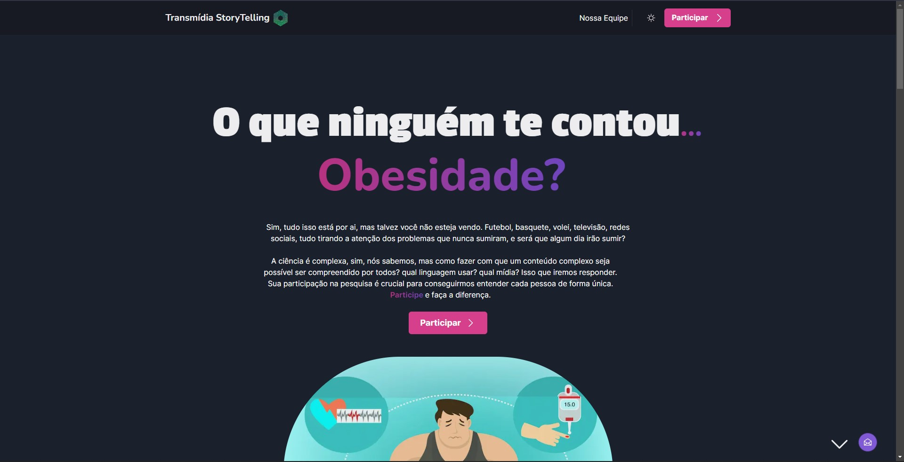
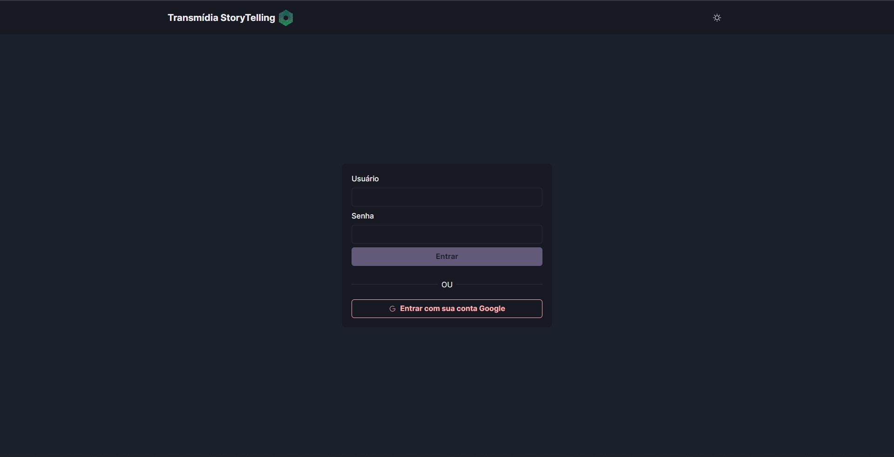
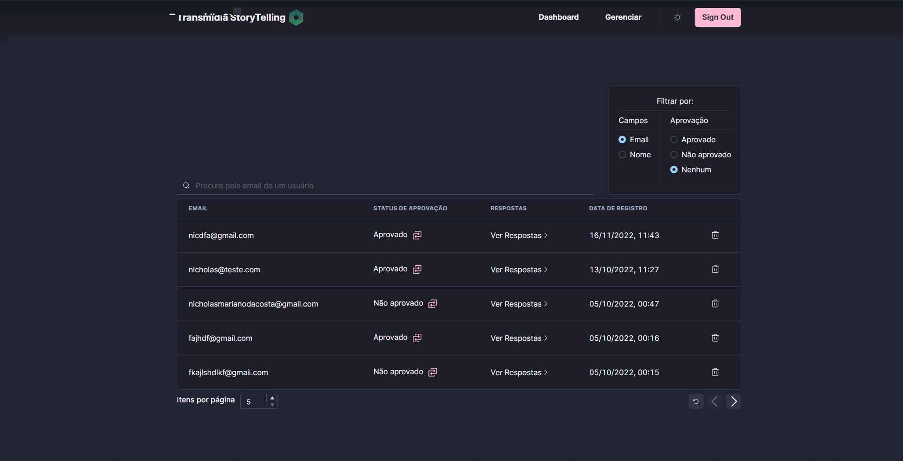
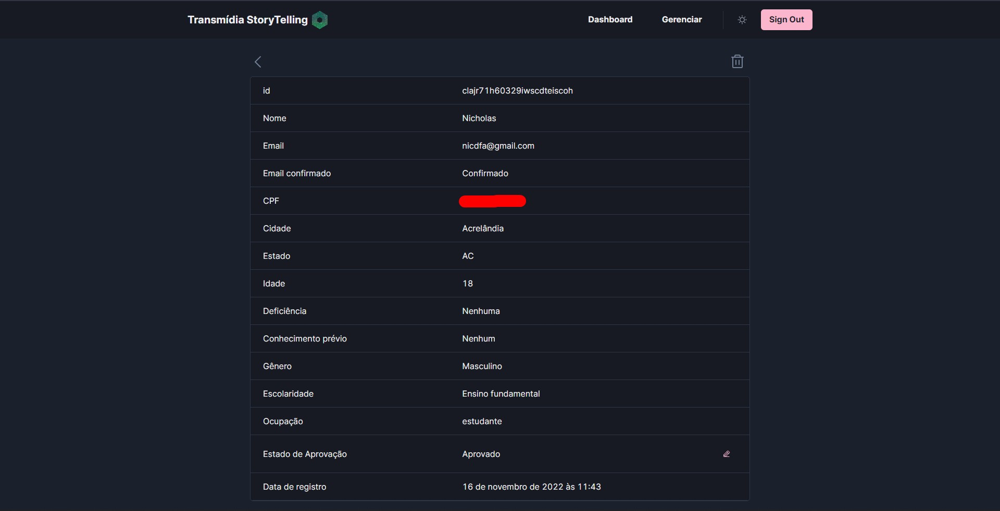
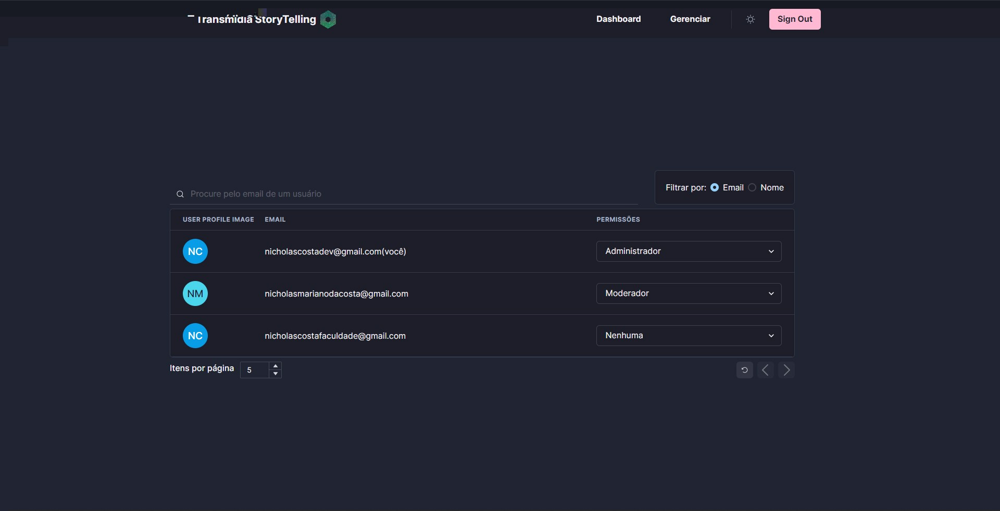

# Transmidia Storytelling



|      Português      |      English      |
|---------------------|-------------------|
| [pt-BR](#português) | [en-US](#english) |

**pt-BR** - Falar e entender sobre ciência não é tão fácil quanto poderia ser, isso é fato, mas o que poderíamos fazer quanto a isso?

Ficar parado não é uma opção.

**en-US** - Talking and understanding abou science is not that ease, and that's a fact, but what can we do about that?

Stand still is not an option.

# Português

## O que é o Transmidia Storytelling?

_Storytelling_ é uma narração de histórias, mas não apenas histórias sem graça, e sim histórias que consigam captar o interesse e foco das pessoas, utilizando não só recursos textuais, mas também audiovisuais. Usar esse método tão poderoso para contar histórias junto com a diversidade de mídias para ensinar pessoas, se torna ainda mais poderoso.

## Sobre o projeto

Nosso projeto é sobre encontrar a mídia e a maneira certa de comunicar sobre ciência. Com a chegada da pandemia, o que mais se ouvia falar era sobre fake news, tudo era muito incerto no momento e muitos aproveitaram para divulgar informações equivocadas, e as pessoas que queriam disseminar a verdade, acabaram não tendo visibilidade suficiente.

Esse é só um exemplo de como a divulgação científica não estava e nem está em sua melhor forma, faltava divulgação, mas divulgação de forma correta e certeira.

### Como isso seria feito?

Nós iremos realizar uma pesquisa totalmente voluntária, em que as pessoas irão se cadastrar através do nosso site.

Através da nossa pesquisa esperamos conseguir dados suficientes para ajudar pessoas que têm como objetivo a divulgação científica, dados como:

- Melhor lugar para falar sobre tal assunto e como falar, ex:
  - COVID - Instagram, utilizando de um estilo mais cômico, não muito formal
  - Obesidade - YouTube, utilizando de um estilo mais sério
  - Pessoas com idade > 30 anos, tendem a preferir o Instagram como mídia para consumir conteúdos científicos. Possíveis motivos:
    - Não possui muito tempo no seu dia para ficar lendo textos longos, então preferem conteúdos mais curtos e direto ao ponto.

### Qual o nosso objetivo com o projeto?

Por mais que isso possa se tornar rentável, não é o nosso objetivo no momento, temos um objetivo muito maior do que o dinheiro possa fazer, a educação deve ser a motivação principal para muitas coisas, e a nosso projeto não foge disso.

Fazer com que a nossa linda ciência seja divulgada da maneira certa para todos, é só uma parte de um grande mundo de objetivos que nós temos a cumprir como pessoas.

Esperamos que você acompanhe a gente nessa jornada, sua participação significa muito para nós!

### Rotas disponíveis

#### Rotas públicas

- /
  - 
- /participate
  - 
- /admin
  - 

#### Rotas privadas

- /admin/dashboard
  - 
- /answers/[userId]
  - 
- /admin/manageusers
  - 

### O código será aberto para sempre?

Sim, a razão de estarmos fazendo isso é pela própria educação, então nada melhor que disponibilizar a maneira de como conseguimos realizar o projeto.

### Posso contribuir para o projeto com o que sei?

Claro que você pode, tanto no âmbito da programação quanto o científico.

Caso tenha alguma sugestão de alteração, você pode mandar pelo próprio site no widget no canto inferior direito e escrever por lá o seu feedback.

Caso você seja um programador e queira ajudar no desenvolvimento, basta seguir o próximo tópico, que será explicado tudo que você deverá fazer para contribuir.

## Como posso contribuir no código?

Primeiro, você precisa ter o `node` instalado na sua versão LTS e o `yarn`

Após ter instalado os dois requisitos, é só continuar pelo seu terminal com os seguintes comandos:

```bash
# Clone o repositório 
git clone https://github.com/nicholascostadev/transmidia-storytelling.git

# Entre na pasta criada
cd transmidia-storytelling

# Instale as dependências
yarn install # ou apenas "yarn"

# Rode o servidor de desenvolvimento
yarn dev
```

Ainda é necessário configurar as variáveis de ambiente, então use o seguinte comando:

```bash
# dentro do projeto
cp ./.env.example ./.env
```

Agora complete o arquivo `.env` com as variáveis de ambiente que você não possui

Caso você use o SQLite, deixe seu `model Account` no `schema.prisma` assim:

```js
model Account {
    id                String  @id @default(cuid())
    userId            String
    type              String
    provider          String
    providerAccountId String
    refresh_token     String? @db.Text
    access_token      String? @db.Text
    expires_at        Int?
    token_type        String?
    scope             String?
    id_token          String? @db.Text
    session_state     String?
    user              User    @relation(fields: [userId], references: [id], onDelete: Cascade)

    @@unique([provider, providerAccountId])
}
```

_Obs.:_ Conceito importante para saber: o modelo `RegisteredUser` se refere a pessoas cadastradas para a pesquisa, já o `User` se refere a contas criadas(Google)

Após completar, tudo estará funcionando para rodar em desenvolvimento.

Para realizar a contribuição, crie uma branch nova e faça suas alterações por lá. Assim que tiver terminado, crie um pull-request com as alterações e eu irei verificá-las.

Pronto!

## Tecnologias Utilizadas

- [NextAuth](https://next-auth.js.org/)
- [Nextjs](https://nextjs.org/)
- [Prisma](https://www.prisma.io/)
- [ChakraUI](https://chakra-ui.com/)
- [Framer Motion](https://www.framer.com/motion/)
- [React Hook Form](https://react-hook-form.com/)
- [zod](https://zod.dev/)
- [TypeScript](https://typescriptlang.org/)

## Ideias de Features

- [ ] Página de análise(pode ser "/analytics") no qual contenha gráficos sobre as pessoas cadastradas para a pesquisa, como:
  - Gráfico por gênero.
  - Gráfico por idade.
  - Gráfico por conhecimento prévio.
  - ...
- [ ] Login com username e senha ao invés de só autenticação com o Google pra limitar o número de pessoas que podem fazer login na aplicação e tirar a dependência do Google.

# English

## What's Transmidia Storytelling?

_Storytelling_  is just like the word, but now with just boring stories, but stories that manage to capture people's interest and focus, using both textual and audiovisual resources. Using this very powerful method to tell stories together with the media diversity, it becomes even more powerful.

## About the project

Our project is about finding the right media and way to communicate about science. With the arrival of the COVID pandemic, what was heard the most was fake news, everything was very uncertain at the time and many people took the opportunity to spread misinformation, and people who wanted to spread the truth, ended up not having enough visibility.

This is just an example of how scientific dissemination was not and is not in its best form, by that time, there was lack of dissemination in the right way, that lead to much misinformation.

### How would that work?

We will conduct an entirely voluntary survey, which people will register through our website.

Through our research we hope to get enough data to help people who aim to disseminate science, data such as:

- Best place to talk about it and how to talk, eg:
  - COVID - Instagram, using a more comic style, not too formal
  - Obesity - YouTube, using a more serious style
  - People aged > 30 years tend to prefer Instagram as a media for consuming scientific content. Possible reasons:
    - They don't have much time in your day to read long texts, so they prefer shorter and more direct content.

### What is our goal with the project?

As much as this can become profitable, it is not our goal at the moment, we have a much greater objective than money can do, education must be the main motivation for many things, and our project does not escape that.

Getting our beautiful science to be disseminated in the right way for everyone is just one part of a great world of goals that we have to fulfill as people.

We hope you join us on this journey, your participation means a lot to us!

### Routes available

#### Public routes

- /
  - 
- /participate
  - 
- /admin
  - 

#### Private routes

- /admin/dashboard
  - 
- /answers/[userId]
  - 
- /admin/manageusers
  - 

### Will the code be open forever?

Yes, the reason we are doing this is for education itself, so nothing better than making available the way we managed to carry out the project.

### Can I contribute to the project with what I know?

Of course you can, both programming and scientific.

If you have any suggestions for changes, you can send them through the website in the widget in the lower right corner and write your feedback there.

If you are a programmer and want to help with development, just follow the next topic, which will explain everything you should do to contribute.

## How can I contribute to the code?

First, you need to have `node` installed on your LTS version and `yarn`

Once you have installed the two requirements, just continue through your terminal with the following commands:

```bash
# Clone the repository
git clone https://github.com/nicholascostadev/transmidia-storytelling.git

# Go to the cloned folder
cd transmidia-storytelling

# Install the dependencies
yarn install # ou apenas "yarn"

# Run the development server
yarn dev
```

It is still necessary to configure the environment variables, so use the following command:

```bash
# inside the project
cp ./.env.example ./.env
```

Now complete the `.env` file with the environment variables you don't have

If you use SQLite, leave your `Account` model in `schema.prisma` like this:

```js
model Account {
    id                String  @id @default(cuid())
    userId            String
    type              String
    provider          String
    providerAccountId String
    refresh_token     String? @db.Text
    access_token      String? @db.Text
    expires_at        Int?
    token_type        String?
    scope             String?
    id_token          String? @db.Text
    session_state     String?
    user              User    @relation(fields: [userId], references: [id], onDelete: Cascade)

    @@unique([provider, providerAccountId])
}
```

_Note:_ Important concept to know: the `RegisteredUser` model refers to people registered for the survey, while the `User` refers to accounts created (Google)

After completing, everything will be ready to run in development.

To make the contribution, create a new branch and make your changes there. Once you're done, create a pull-request with the changes and I'll verify them.

Ready!

## Technologies Used

- [NextAuth](https://next-auth.js.org/)
- [Nextjs](https://nextjs.org/)
- [Prisma](https://www.prisma.io/)
- [ChakraUI](https://chakra-ui.com/)
- [Framer Motion](https://www.framer.com/motion/)
- [React Hook Form](https://react-hook-form.com/)
- [zod](https://zod.dev/)
- [TypeScript](https://typescriptlang.org/)

## Feature ideas

- [ ] Analysis page(maybe "/analytics") where there would be charts about users that registered for the research, like:
  - Graph by gender.
  - Graph by age.
  - Graph by previous knowledge.
  - ...
- [ ] Login with username and password instead of authentication only with Google for limiting the number of people that can log in and also remove the Google dependency to the project.
